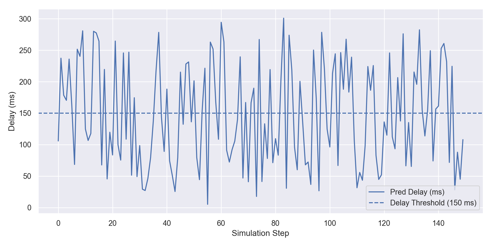
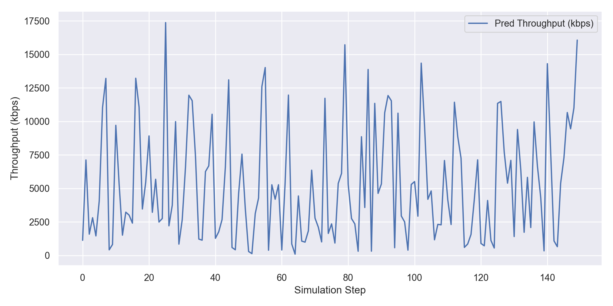
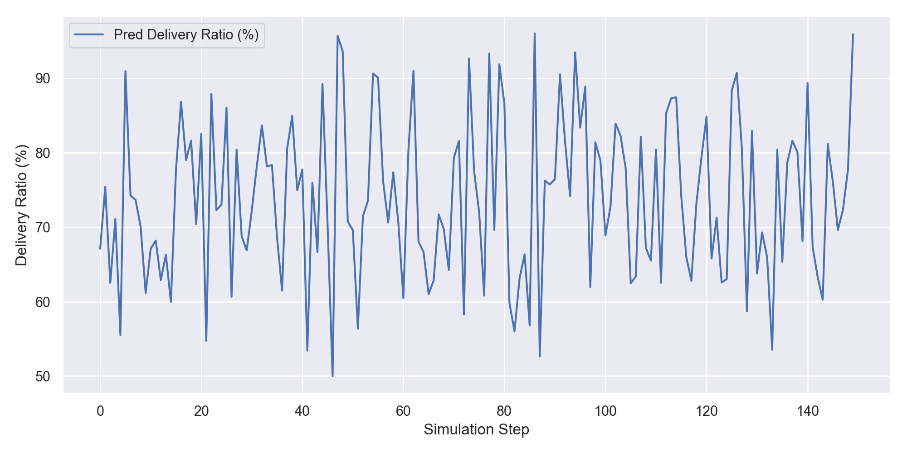

# ML-Based QoS Optimizer for Video Streaming

[](https://github.com/Likkhithhh/QOS-VIDEO/actions/workflows/python-syntax.yml)


A machine-learning simulation for studying **Quality of Service (QoS)** optimization in video-streaming environments.

The project generates network/QoS observations, trains classification and regression models, evaluates model behavior, and runs simulations that produce delivery, delay, and throughput results.

## Why this project matters

Video streaming quality depends on interacting network conditions rather than a single metric. This project combines **networking + ML** to explore adaptive decisions from multiple QoS signals.

## Pipeline

```text
Synthetic QoS data
      ↓
Feature preparation
      ↓
Classifier + regression models
      ↓
Evaluation
      ↓
Streaming simulation
      ↓
QoS metrics and plots
```

## Visual outputs

### Delay


### Throughput


### Delivery ratio


## Main components

- `data_generator.py` — generates synthetic QoS training data
- `train_models.py` — trains classifier and regression models
- `evaluate_models.py` — evaluates trained model performance
- `simulate_run.py` — runs the QoS simulation
- `video_stream_simulation.py` — streaming simulation logic
- `utils.py` — shared utilities
- `requirements.txt` — Python dependencies

## Tech stack

Python, NumPy, pandas, scikit-learn, Matplotlib, seaborn, joblib, and tqdm.

## Setup

```bash
python3 -m venv .venv
source .venv/bin/activate
python3 -m pip install -r requirements.txt
```

Windows:

```powershell
.venv\Scripts\activate
```

## Run

```bash
python3 data_generator.py
python3 train_models.py
python3 evaluate_models.py
python3 simulate_run.py
```

## Reproducibility

Model binaries are generated locally and intentionally excluded from future commits. Re-run `train_models.py` to regenerate them.

## Scope and limitations

This is an educational/simulation project based on synthetic QoS data. It should not be treated as validation on production network traffic.

## Roadmap

- Evaluate on real network traces
- Add reproducible experiment seeds/configuration
- Add unit/integration tests
- Compare additional ML models
- Explore adaptive bitrate decision policies


---

## Portfolio navigation

Explore the rest of my GitHub portfolio:

- [QOS-VIDEO](https://github.com/Likkhithhh/QOS-VIDEO) — machine-learning experiments for video-streaming QoS optimization
- [weatherAPP](https://github.com/Likkhithhh/weatherAPP) — browser weather dashboard using public APIs
- [pingSim](https://github.com/Likkhithhh/pingSim) — Python networking and latency simulator
- [lexgen](https://github.com/Likkhithhh/lexgen) — educational lexer-generator and compiler-design project
- [ATTENDENCEBOT](https://github.com/Likkhithhh/ATTENDENCEBOT) — face-recognition reference work for an attendance-system portfolio project
- **READS — North Karnataka Student Dropout Risk System** — Python/AI/ML internship project at Rural Education and Action Development Society (READS), 03 Aug–03 Sep 2026; focused on student-attribute analysis, preprocessing, dropout-risk prediction, model evaluation, and results
- **READS Karnataka Website** — organization website project built with HTML, CSS, and JavaScript; includes programme/project pages, board/member pages, donor and contact sections, images, and Firebase configuration

**GitHub:** [Likkhithhh](https://github.com/Likkhithhh)
